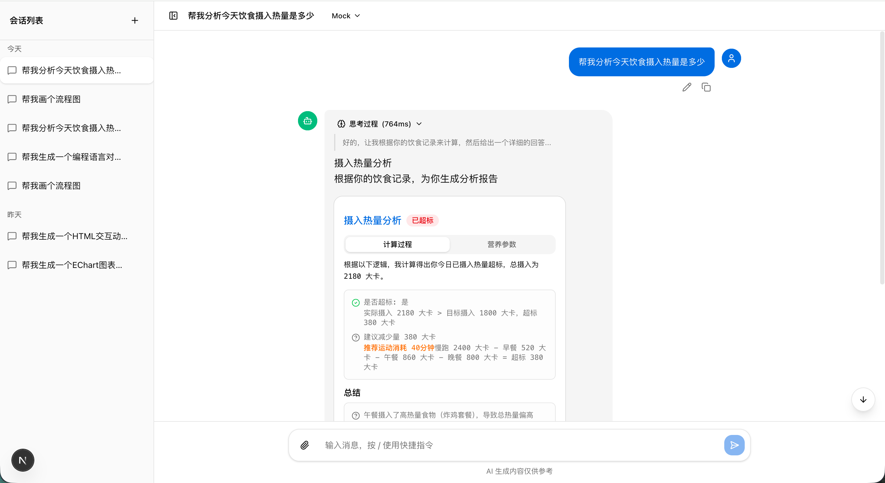
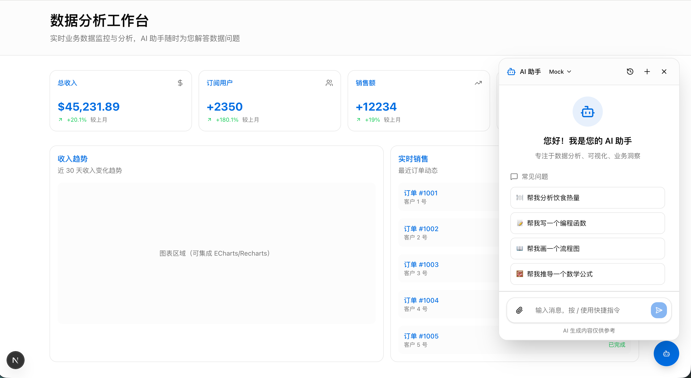

# Next Chat 💬

**让大模型自己生成用户界面。**



---

## 🎯 一句话说明

Next Chat 是一套AI 生成界面(AI-Generated UI)的开发框架。

不同于传统的聊天界面，Next Chat 的核心能力是：**让大模型通过 Markdown 语法直接生成可交互的用户界面**。你只需要告诉 AI "用卡片展示订单详情"，它就能渲染出一个带标签页、按钮、数据的卡片组件。

## ✨ 核心价值

### 1. 🎨 AI 生成界面：Markdown 即 UI

大模型返回的内容不是纯文本，而是**可交互的界面组件**：
数据结构参考如下：

```card
{
  "title": "订单 #12345",
  "tabs": [
    { "label": "基本信息", "content": "..." },
    { "label": "物流信息", "content": "..." }
  ],
  "footer": {
    "buttons": [
      { "text": "确认收货", "actionType": "confirm" }
    ]
  }
}
```

**支持的 AI 生成组件**：

| 组件 | 语法 | 说明 |
|------|------|------|
| 📋 交互卡片 | ` ```card ` | 结构化数据 + 标签页 + 按钮 |
| 📊 数据图表 | ` ```echart ` | ECharts 可视化 |
| 📈 流程图 | ` ```mermaid ` | Mermaid 图表 |
| 🔢 数学公式 | ` $E=mc^2$ ` | LaTeX 渲染 |
| 🎨 交互页面 | ` ```html ` | 沙箱运行 HTML |
| � 代码块 | ` ```python ` | 语法高亮 + 复制 |
| 📝 表格 | Markdown 表格 | 数据对比 |
|其他组件|` ```xxx ` | 可扩展其他自定义组件 |

> 💡 **核心理念**：组件可无限扩展，新增一个组件类型，大模型就能生成一种新界面。

### 2. 🔌 开箱即用的 API 调试前端

集成真实 AI 服务前，需要一个界面来调试接口。Next Chat 提供完整的对话前端：

```
npm run dev
→ 访问 http://localhost:3000
```

**能力**：
- ✅ 流式响应（SSE）
- ✅ Provider 切换（Mock / OpenAI / Ollama）
- ✅ 消息反馈（👍 👎）
- ✅ 重新生成
- ✅ 快捷指令 + 建议回复
- ✅ 对话历史管理

**Mock 模式内置场景**（无需 API Key）：

| 快捷指令 | 返回内容 |
|----------|----------|
| 热量分析 | 📋 卡片 + 标签页 |
| 代码编写 | 💻 高亮代码 |
| 数据表格 | 📊 Markdown 表格 |
| 图表可视化 | 📈 Mermaid 流程图 |
| 公式推导 | 🔢 LaTeX 公式 |
| EChart图表 | 📊 ECharts 图表 |
| HTML演示 | 🎨 交互动画 |

### 3. 🧩 可嵌入的 AI 助手组件

不想用完整页面？只需几行代码，把 AI 助手嵌入到你的系统里：

```tsx
import { Entrance } from '@/components/ai-assistant/entrance'
import { HoverIcon } from '@/components/ai-assistant/hover-icon'

// 嵌入到任意页面
<Entrance
  visible={showAssistant}
  onClose={() => setShowAssistant(false)}
  agentPresets={[
    {
      name: '数据分析助手',
      description: '专注业务数据洞察',
      faq: [
        { label: '本月销售额', icon: '📊', prompt: '...' },
      ]
    }
  ]}
/>
```

**接入效果**：


**适用场景**：
- 📊 数据分析平台 → 加一个"数据问答助手"
- 🛒 电商后台 → 加一个"运营助手"
- 📚 帮助中心 → 加一个"文档助手"
- 📋 管理系统 → 加一个"智能客服"

## 🏗️ 架构设计

```
┌─────────────────────────────────────────────────────────┐
│                      你的页面                             │
│  ┌─────────────────────────────────────────────────┐     │
│  │  Entrance / HoverIcon  ← 可复用组件             │     │
│  │  ┌───────────────────────────────────────────┐ │     │
│  │  │           对话界面                        │ │     │
│  │  │  ┌─────────────────────────────────────┐  │ │     │
│  │  │  │    MarkdownRender                   │  │ │     │
│  │  │  │  ┌─────────────────────────────┐    │  │ │     │
│  │  │  │  │  ```card  → <CardBlock />   │    │  │ │     │
│  │  │  │  │  ```echart → <EChartBlock />│    │  │ │     │
│  │  │  │  │  ```mermaid→ <MermaidDiagram│    │  │ │     │
│  │  │  │  │  ```html  → <HTMLBlock />   │    │  │ │     │
│  │  │  │  │  $公式$   → <KaTeX />       │    │  │ │     │
│  │  │  │  └─────────────────────────────┘    │  │ │     │
│  │  │  └─────────────────────────────────────┘  │ │     │
│  │  └───────────────────────────────────────────┘ │     │
│  └─────────────────────────────────────────────────┘     │
└─────────────────────────────────────────────────────────┘
                          ↓
┌─────────────────────────────────────────────────────────┐
│                    /api/chat                            │
│   Mock ←──────→  OpenAI ←──────→  Ollama               │
│   (内置场景)     (通义千问)        (本地模型)            │
└─────────────────────────────────────────────────────────┘
```

**三层能力**：

| 层级 | 说明 |
|------|------|
| **表现层** | MarkdownRender 解析 Markdown + 自定义组件 |
| **交互层** | 卡片按钮交互 → 发送消息 → 触发 AI 继续响应 |
| **接入层** | Entrance 组件 → 嵌入任意页面 |

## 🚀 快速开始

### 安装

```bash
npm install
```

### 启动

```bash
npm run dev
```

| 页面 | 地址 | 用途 |
|------|------|------|
| 对话首页 | http://localhost:3000 | 完整对话界面 |
| AI 助手演示 | http://localhost:3000/demo | 嵌入式助手效果 |

### 配置 AI（可选）

默认 Mock 模式，无需任何配置。

```bash
cp .env.example .env.local
```

```env
# 通义千问
OPENAI_API_KEY=sk-xxxx
OPENAI_BASE_URL=https://dashscope.aliyuncs.com/compatible-mode/v1/chat/completions
OPENAI_MODEL=qwen-max
```

## 🛠️ 技术栈

| 类别 | 技术 |
|------|------|
| 框架 | Next.js 16 (App Router) |
| React | 19 |
| TypeScript | 5 |
| UI | shadcn/ui + Radix UI |
| 样式 | Tailwind CSS 4 |
| 状态 | Zustand 5 |
| Markdown | react-markdown + remark-gfm |
| 图表 | Mermaid + ECharts |
| 公式 | KaTeX |

## 📦 项目结构

```
components/
├── ai-assistant/
│   ├── entrance.tsx      # 可嵌入的对话面板
│   └── hover-icon.tsx    # 悬浮图标
└── chat/
    ├── markdown-render.tsx     # 核心渲染器
    └── markdown-extensions/    # 可扩展组件
        ├── card-block.tsx      # 卡片
        ├── echart-block.tsx    # 图表
        ├── mermaid-diagram.tsx # 流程图
        ├── latex-formula.tsx   # 公式
        └── html-block.tsx      # HTML 沙箱
```

## 🎨 自定义主题

```css
/* app/globals.css */
:root {
  --primary: oklch(0.55 0.2 255);
}
```

## 🚀 部署

**Vercel**:
1. Fork → Import → Deploy
2. 配置环境变量
3. 完成

**Docker**:
```bash
docker build -t next-chat .
docker run -p 3000:3000 next-chat
```

## 📜 开发脚本

```bash
npm run dev    # 开发
npm run build  # 构建
npm run start  # 生产
npm run lint   # 检查
```

## ⚠️ 注意

- Mock 模式支持全部功能演示，无需 API Key
- API Key 存储在 `.env.local`，不会提交到 Git
- 生产环境通过平台环境变量配置

## 📄 License

MIT

---