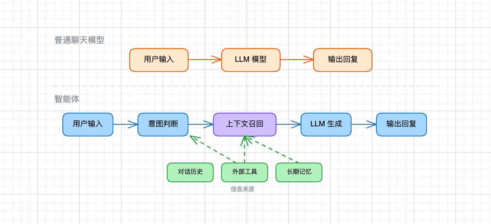

## 把执行交给 AI，把判断留给自己

### AI时代的学习路径
1. 自己先定义目标
2. 自己先判断系统边界
3. 让 AI 快速完成执行层面的铺设
4. 自己重点检查结构是否合理
5. 再围绕关键节点做深入理解

### 在执行层面，你应该充分信任 AI
工程世界里，真正昂贵的不是「把代码敲出来」，而是：
- 知道该做什么
- 知道不该做什么
- 知道哪里要快，哪里要稳
- 知道哪一层可以妥协，哪一层不能出错

**AI 不是在削弱你的价值，而是在逼着你的价值往更高层移动!**

### AI 时代真正稀缺的，不是写代码，而是做判断
真正会越来越值钱的，是下面这些能力：
1. 把模糊问题说清楚
2. 把复杂系统拆成可管理的层次
3. 为一个系统设计合理边界
4. 在多个方案之间做取舍
5. 能快速识别哪里是伪复杂，哪里是真复杂
6. 知道什么时候该追求速度，什么时候必须优先稳定性
这些能力不会因为 AI 变强而贬值，反而会因为 AI 足够强而被进一步放大。

### 什么是 AI 智能体开发
我们的工作不是让模型"变聪明"——那是 OpenAI、Anthropic、DeepSeek 等公司的事情。我们的工作是给模型补上它缺失的能力：记忆、情绪、安全、持久化、多用户管理等。
**AI 智能体开发，就是让大模型不只”回答一句话”，而是围绕一个目标，主动召回上下文、调用工具、执行多步动作，最终完成任务。**

普通 LLM 应用强调”生成回复”，智能体应用强调”为了完成目标而组织动作”。

